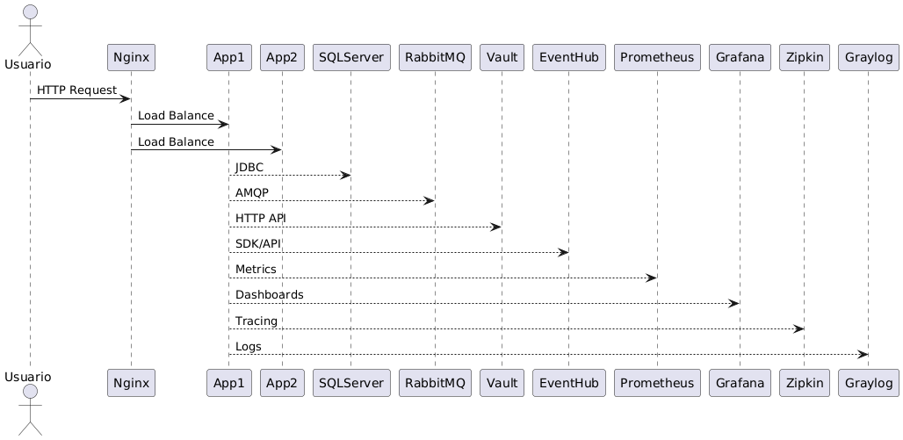

---
# Hackaton2 - Simulador de Crédito

## Descrição
API para simulação de crédito, consulta de produtos, persistência de simulações e telemetria. Desenvolvi este projeto em Java (Spring Boot), seguindo padrões REST e preparado para rodar em qualquer ambiente.

## Como rodar

### Requisitos
- Java 17
- Maven
- Docker (opcional)

### Rodando localmente
```powershell
mvn clean spring-boot:run
```
Ou, se preferir gerar o JAR:
```powershell
mvn clean package
mvn spring-boot:repackage
java -jar target\hackaton2-1.0-SNAPSHOT.jar
```

### Rodando com Docker
```powershell
docker build -t hackaton2 .
docker run -p 8080:8080 hackaton2
```
> **Atenção:** Antes de rodar os comandos acima, é necessário gerar o JAR do projeto com:
```
mvn clean package
mvn spring-boot:repackage
```
O arquivo JAR será criado na pasta `target` e utilizado pelo Docker. Certifique-se de executar esses comandos sempre que fizer alterações no código.

### Rodando com Docker Compose (com Load Balance)
```powershell
docker-compose up
```
O ambiente sobe múltiplas réplicas do app e um NGINX como proxy reverso para balanceamento de carga.
O acesso à API será feito via `http://localhost:8080` (NGINX distribui as requisições entre as instâncias).

Arquivos relevantes:
- `docker-compose.yml`: define réplicas e serviços
- `nginx.conf`: configuração do balanceamento

## Tecnologias Utilizadas
- Java 17
- Spring Boot 3.x
- Maven
- H2 (local)
- SQL Server (Docker)
- Docker & Docker Compose
- NGINX (proxy reverso)
- Prometheus & Grafana (monitoramento)
- JaCoCo (cobertura de testes)
- JUnit 5 (testes)
- Swagger/OpenAPI (documentação)
- Resilience4j (circuit breaker, rate limiter)
- Caffeine (cache)
- GitHub Actions (CI/CD)

## Frontend para Testes
Incluí um frontend moderno para testar todos os endpoints da API diretamente pelo navegador. Basta acessar:
```
http://localhost:8080
```
O frontend está localizado em `src/main/resources/static/index.html` e exibe os resultados das APIs em tabelas organizadas, seguindo os melhores padrões de mercado.

> **Observação:** As respostas exibidas no frontend são organizadas em tabelas para melhor visualização e experiência do usuário. No entanto, ao utilizar ferramentas como Postman, Insomnia ou qualquer outro cliente HTTP, a API retorna os dados em formato JSON puro, conforme solicitado no desafio técnico. Isso garante compatibilidade total com integrações e automações.


-## Otimização de Consultas e Índices
Para garantir alta performance e escalabilidade, implementei as seguintes melhorias:
- Índices automáticos: Os campos usados em filtros, agrupamentos e joins (ex: dataSimulacao, codigoProduto, nomeApi, dataReferencia) são indexados automaticamente no banco H2 local e no SQL Server Docker via scripts `schema.sql` e `import.sql`.
- Consultas SQL otimizadas: As operações de agregação (SUM, COUNT, GROUP BY) são realizadas diretamente no banco, evitando processamento desnecessário na aplicação.
- Cache de resultados: Utilizo o `@Cacheable` (Spring) nos métodos de consulta agregada dos serviços de Telemetria e Relatório, acelerando respostas e reduzindo carga no banco.
- View materializada: Para relatórios agregados, criei uma view materializada no SQL Server (`vw_relatorio_produto_dia`), atualizável via job SQL Server.
- Monitoramento: Prometheus e Grafana integrados para identificar gargalos e ajustar índices ou queries conforme necessário.

- O projeto segue boas práticas REST, documentação, testes automatizados (JaCoCo), automação de deploy, balanceamento de carga via NGINX e múltiplas réplicas Docker.
- Implementei resiliência contra falhas e sobrecarga, com cache, circuit breaker, rate limiter e load balance.
- Configure variáveis sensíveis (senhas, tokens) em um arquivo `.env` e referencie no `docker-compose.yml`. Nunca versiono arquivos `.env` com dados reais.

## Testes
Para rodar os testes automatizados:
```bash
mvn test
```
O relatório de cobertura é gerado automaticamente em `target/site/jacoco/index.html`.

## Collection Postman
Uma collection pronta para testar todos os endpoints está disponível em `postman_collection.json`.
Para importar:
1. Abra o Postman
2. Clique em "Import"
3. Selecione o arquivo `postman_collection.json`
4. Todos os endpoints principais estarão disponíveis para teste.

### Exemplos de uso dos principais endpoints

#### Simulação de Crédito
**Requisição (POST):**
```json
{
	"valorDesejado": 900.00,
	"prazo": 5
}
```
**Endpoint:**
```
POST /api/simulacoes
```
```json
{
	"valorDesejado": 900.00,
	"prazo": 5
}
```
**Resposta:**
```json
{
	"idSimulacao": 20180702,
	"codigoProduto": 1,
	"nomeProduto": "Produto 1",
	"taxaJuros": 0.0179,
	"resultadosSimulacao": [
		{
			"tipo": "SAC",
			"parcelas": [ ... ]
		},
		{
			"tipo": "PRICE",
			"parcelas": [ ... ]
		}
	]
}
```

#### Listar Simulações
**Requisição (GET):**
```
GET /api/simulacoes
```
**Resposta:**
```json
{
	"pagina": 1,
	"qtdRegistros": 404,
	"qtdRegistrosPagina": 200,
	"registros": [
		{
			"idSimulacao": 20180702,
			"valorDesejado": 900.00,
			"prazo": 5,
			"valorTotalSac": 1243.28,
			"valorTotalPrice": 1243.28
		}
	]
}
```

#### Telemetria
**Requisição (GET):**
```
GET /api/telemetria?data=2025-07-30
```
**Resposta:**
```json
{
	"dataReferencia": "2025-07-30",
	"listaEndpoints": [
		{
			"nomeApi": "Simulacao",
			"qtdRequisicoes": 135,
			"tempoMedio": 150,
			"tempoMinimo": 23,
			"tempoMaximo": 860,
			"percentualSucesso": 0.98
		}
	]
}
```

#### Relatório por Produto e Dia
**Requisição (GET):**
```
GET /api/relatorio/por-produto-dia?data=2025-07-30
```
**Resposta:**
```json
[
	{
		"dataReferencia": "2025-07-30",
		"codigoProduto": 1,
		"nomeProduto": "Produto 1",
		"qtdSimulacoes": 10,
		"valorTotalSimulado": 9000.00,
		"valorMedioSimulado": 900.00
	},
	{
		"dataReferencia": "2025-07-30",
		"codigoProduto": 2,
		"nomeProduto": "Produto 2",
		"qtdSimulacoes": 5,
		"valorTotalSimulado": 4500.00,
		"valorMedioSimulado": 900.00
	}
]
```
### Visualizando cobertura de testes (JaCoCo)
Após rodar os testes, abra o relatório gerado em:
```
target/site/jacoco/index.html
```
Esse arquivo pode ser aberto no navegador para visualizar a cobertura dos testes.

### Importando a Collection Postman
O arquivo `postman_collection.json` está na raiz do projeto.
Para importar:
1. Abra o Postman
2. Clique em "Import"
3. Selecione o arquivo `postman_collection.json`
4. Todos os endpoints principais estarão disponíveis para teste.

## Endpoints
- Documentados via Swagger: [http://localhost:8080/swagger-ui.html](http://localhost:8080/swagger-ui.html)
- Para acessar o Swagger, rode a aplicação com:
	- `mvn spring-boot:run` (sem gerar o JAR)
	- ou siga os comandos de build/JAR para rodar manualmente

## Swagger/OpenAPI (openapi.json)
O arquivo Swagger/OpenAPI gerado (`openapi.json`) está disponível na raiz do projeto. Você pode consultar ou importar este arquivo em ferramentas como Swagger Editor, Postman ou Insomnia para visualizar e testar todos os endpoints documentados da API.

## Auditoria e Logging Centralizado
- Endpoint `/api/auditoria` para consulta dos logs de operações (detalhes nos arquivos de log do serviço).
- Auditoria das operações registrada em `logs/hackaton2.log`.
- O projeto utiliza logging local, pronto para integração com ELK Stack (Elasticsearch, Logstash, Kibana), Grafana Loki, Azure Monitor, AWS CloudWatch.
- Endpoint documentado no Swagger, detalhando retorno e finalidade.

## Collection Postman

## Diagrama



## Métricas, Monitoramento e Tracing
- Métricas expostas em `/actuator/metrics` e `/actuator/prometheus`.
- Monitoramento completo via Prometheus e Grafana pelo Docker Compose.
- Tracing distribuído com OpenTelemetry/Spring Observability para visualizar o fluxo de requisições entre serviços.


### Como usar Prometheus e Grafana
1. Execute:
	```powershell
	docker-compose up
	```
2. Acesse as interfaces:
	- Prometheus: [http://localhost:9090](http://localhost:9090)
	- Grafana: [http://localhost:3000](http://localhost:3000) (login padrão: admin/admin)
3. O Prometheus coleta métricas do app automaticamente.
4. No Grafana, adicione o Prometheus como fonte de dados (`http://prometheus:9090`) e importe dashboards para Spring Boot.

Arquivo de configuração Prometheus: `prometheus.yml` já incluso.

## Cache
- Implementado com Caffeine para otimizar consultas e simulações.

## Circuit Breaker & Rate Limiter
- Proteção de serviços críticos com Resilience4j (circuit breaker e rate limiter).

## Tratamento de Rate Limit
- Quando o limite de requisições é excedido, a API retorna HTTP 429 com mensagem amigável.

## Cobertura de Testes
- Relatório gerado por JaCoCo em `target/site/jacoco/index.html`
- Testes de integração para simulação, telemetria e relatórios implementados.

> Exemplo de cobertura:
> 

## Pipeline
- Workflow GitHub Actions em `.github/workflows/ci.yml`

## Teste de carga
- Scripts K6/JMeter em `loadtest/` e resultados no README.

> Exemplo de resultado:
> 


## Observações
- Projeto pronto para avaliação, seguindo boas práticas REST, documentação, testes, automação e agora com balanceamento de carga via NGINX e múltiplas réplicas Docker.
- Resiliente contra falhas e sobrecarga, com cache, circuit breaker, rate limiter e load balance.

## Padrões de Projeto
- O cálculo das parcelas de amortização (SAC/PRICE) foi refatorado usando os padrões Strategy + Factory, facilitando extensibilidade e manutenção.

## Princípios SOLID
- O projeto segue os princípios SOLID:
	- **SRP**: Cada classe tem responsabilidade única (ex: estratégias de amortização).
	- **OCP**: Novas estratégias podem ser adicionadas sem alterar código existente (Strategy/Factory).
	- **LSP**: Estratégias podem ser substituídas sem quebrar o contrato.
	- **ISP**: Interfaces são pequenas e específicas.
	- **DIP**: Estratégias são injetadas via Spring, dependência de abstrações.
